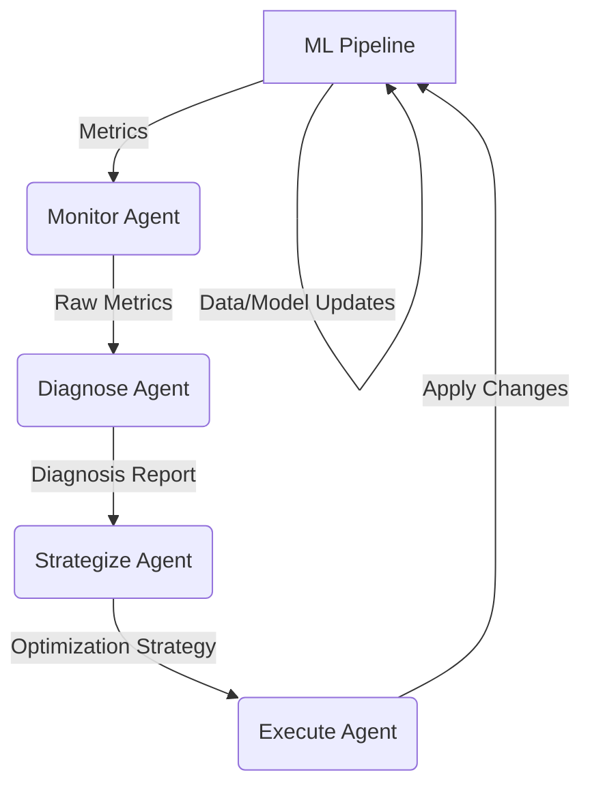

# AutoML Pipeline Agent 🤖

[](https://github.com/your-org/auto-ml-pipeline-agent/actions/workflows/main.yml)
[](https://pypi.org/project/auto-ml-pipeline-agent/)
[](https://opensource.org/licenses/MIT)

## Autonomous multi-agent system for real-time ML pipeline monitoring, diagnosis, and optimization.

### The Problem 😩
Manual MLOps is a continuous battle. Data drift, concept drift, model decay, and fluctuating resource needs constantly threaten the stability and performance of your machine learning pipelines. Identifying bottlenecks, diagnosing issues, and implementing fixes manually is slow, error-prone, and expensive. It's like flying a plane by constantly tweaking every dial by hand!

### The Solution ✨
**AutoML Pipeline Agent** leverages a sophisticated multi-agent AI system to bring true autonomy to your ML operations. It continuously monitors your entire ML pipeline lifecycle, intelligently diagnoses issues, and proactively applies optimizations, ensuring your models remain robust, accurate, and efficient, without constant human intervention.

### Features 🚀
*   **Real-time Monitoring:** Continuously tracks critical metrics across your pipeline: data quality (distributions, completeness), model performance (accuracy, latency), and resource utilization (CPU, memory).
*   **AI-driven Diagnosis:** Intelligent `DiagnoseAgent` analyzes anomalies and identifies root causes. It can detect data drift, concept drift, model performance degradation, and resource bottlenecks.
*   **Adaptive Optimization:** The `StrategizeAgent` automatically proposes tailored improvements. The `ExecuteAgent` can then apply these changes, such as hyperparameter tuning, model retraining, data preprocessing adjustments, or even data source recalibration.
*   **Self-Healing Pipelines:** Learns from past optimizations and environmental changes, enabling proactive adaptation and preventing future issues before they impact performance.
*   **LLM Integration (Optional):** Designed for seamless integration with large language models to generate human-readable insights for complex diagnoses and to explore more sophisticated optimization strategies.
*   **Modular & Extensible:** Easily add custom monitors, diagnostic rules, optimization strategies, and integrate with existing MLOps tools and cloud platforms.

### Installation 🛠️

1.  **Via PyPI (Recommended):**
    ```bash
    pip install auto-ml-pipeline-agent
    ```

2.  **From Source:**
    ```bash
    git clone https://github.com/your-org/auto-ml-pipeline-agent.git
    cd auto-ml-pipeline-agent
    pip install -e .
    ```

### Usage 🏁
AutoML Pipeline Agent provides a simple Python API to integrate into your existing ML workflows. Define your pipeline components, set up your initial baselines, and let the agents handle the rest.

Here's a quick example to get started:

```python
from auto_ml_pipeline_agent.main_code import DataGenerator, Preprocessor, ModelTrainer, PipelineOptimizer

# 1. Initialize your pipeline components
data_gen = DataGenerator()
preprocessor = Preprocessor()
model_trainer = ModelTrainer()

# 2. Create the PipelineOptimizer with your components
optimizer = PipelineOptimizer(data_gen, preprocessor, model_trainer)

print("\n--- Starting AutoML Pipeline Agent --- ")

# 3. Run initial cycle to establish baselines
optimizer.run_optimization_cycle() # This will train initial model and collect baseline metrics

print("\n--- Running several healthy cycles --- ")
for i in range(2):
    print(f"\n--- Optimization Cycle {i+1} --- ")
    optimizer.run_optimization_cycle()

print("\n--- Simulating a major data drift event --- ")
data_gen.induce_drift(factor=0.6)

print("\n--- Agent expected to detect drift and take action --- ")
for i in range(3):
    print(f"\n--- Optimization Cycle {i+3} (with drift) --- ")
    optimizer.run_optimization_cycle()

print("\n--- Observing post-fix performance --- ")
for i in range(2):
    print(f"\n--- Optimization Cycle {i+6} (post-fix) --- ")
    optimizer.run_optimization_cycle()

print("\n--- AutoML Pipeline Agent demonstration complete. --- ")
```

### Architecture 🏗️
The system is built around a robust multi-agent framework, with each agent specializing in a critical aspect of pipeline management:

1.  **Monitor Agent:** Collects real-time metrics (data statistics, model performance, resource usage) from the active ML pipeline.
2.  **Diagnose Agent:** Analyzes the collected metrics against established baselines and historical data to identify anomalies and pinpoint the root causes of issues.
3.  **Strategize Agent:** Based on the diagnosis, proposes a set of optimal strategies to mitigate identified problems. This could involve hyperparameter adjustments, data recalibration, or even architectural changes.
4.  **Execute Agent:** Implements the chosen strategies directly into the live pipeline components. It ensures changes are applied safely and effectively.

This continuous feedback loop allows the system to be self-correcting and adaptive.



### Contributing ❤️
We welcome contributions from the community! Whether it's bug reports, feature requests, or pull requests, all help is appreciated.

Please refer to our [CONTRIBUTING.md](CONTRIBUTING.md) for detailed guidelines.

### License 📄
This project is licensed under the MIT License - see the [LICENSE](LICENSE) file for details.
